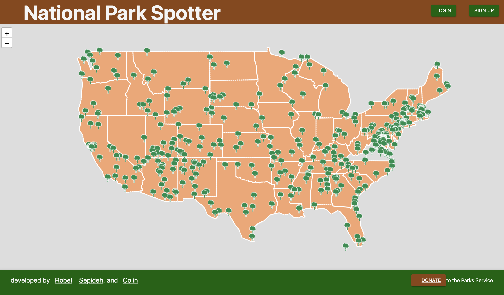
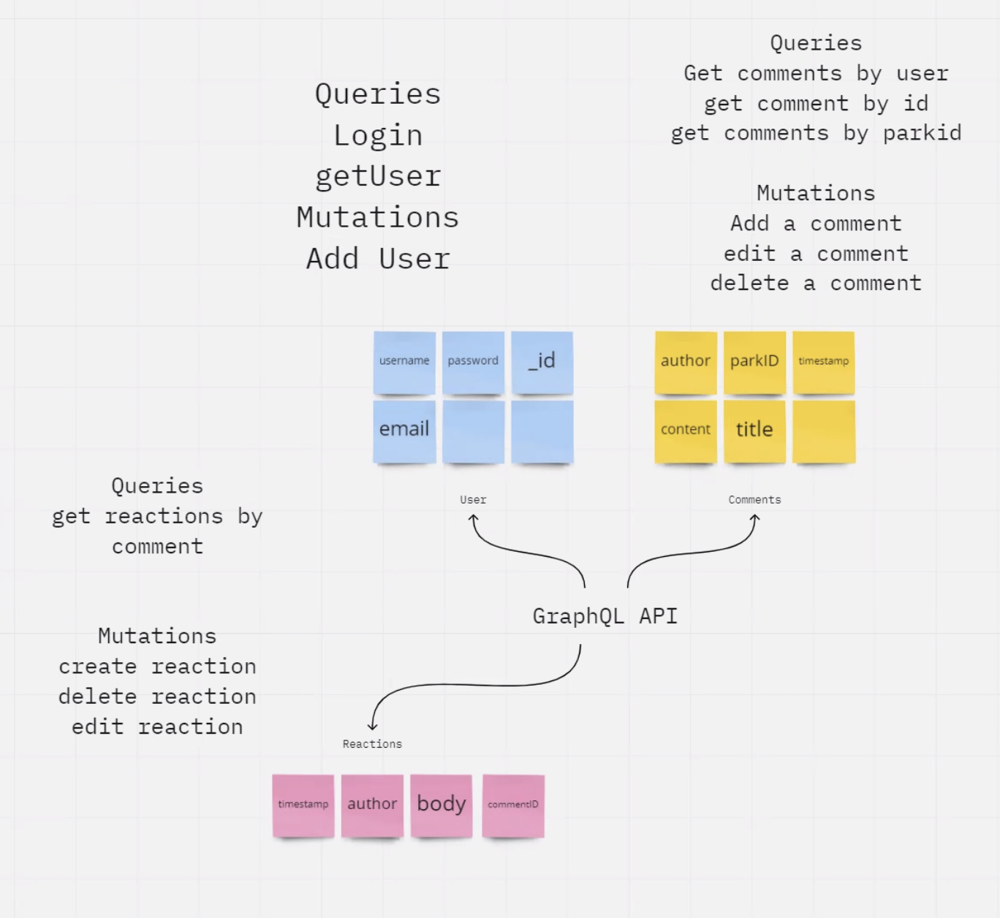

# National Parks Spotter

This is an application that allows the user to click on a desired National Park and see the list of the campgrounds for that park, and some other useful information about the park.

         <br> 

## User Story
AS a National Park geek,
I want to be able to see a list of National Parks and when I click on each of them,
I want to be able to see useful information about the park, location, visitor center hours and contact number, map and available campground. I would also like to see a wheelchair accessible trails and campground in the park. 
So that they can keep a list of books to purchase.

## Table of Contents 
1. [Project Links](#Project-Links)
1. [Screenshots](#Screenshot)
1. [Deployed App](#Deployed-App)
1. [Installation](#Installation)
1. [Contribution Guidelines](#Contribution-Guidelines)
1. [Project Team](#Project-Team)
1. [Questions](#Questions)
1. [License](#License)

## Project Links
[Repo Link](https://github.com/SepidehAyani/national-parks-spotter) <br>

## Screenshots
#### Homepage

#### GraphQL Architecture



## Deployed App
Find deployed app [here](https://pacific-brushlands-65513.herokuapp.com/)

## Instructions
* To use this app npm init has to be called to create your `package.json` file.
* The following necessary `npm` dependencies must be installed to run the application properly: the needed dependencies will be found on the `package.json` file. Simply run `npm i` to install the needed dependencies.
* To properly install the database you must create at cluster on `Mongodb atlas`.
* Run `npm start` for the port to start listening with mongoose.
* This app is deployed on `Heroku`

#### Languages and libraries used in this project:
- <a href="https://nodejs.org/">Node.js</a>
- <a href="https://www.npmjs.com/package/express">Express.js</a>
- <a href="https://www.mongodb.com/">MongoDB</a>
- <a href="https://mongoosejs.com/">Mongoose</a>
- <a href="https://www.javascript.com/">JavaScript</a>
- <a href="https://reactjs.org/">REACT</a>
- <a href="https://www.apollographql.com/docs/apollo-server/">Apollo Server</a>
- <a href="https://graphql.org/">GraphQL</a>
- <a href="https://www.npmjs.com/package/dotenv">dotenv</a>
- <a href="https://www.heroku.com/">Heroku</a>

## Contribution Guidelines:
```  
Feel free to contribute to this repo by creating issues or sending an email to any of the contributors in the list below. 
```
## Project Team
[Robel Gebremeskel](https://github.com/robel-codes) <br>
[Colin Bares](https://github.com/soundproofboot) <br>
[Sepideh Ayani](https://github.com/SepidehAyani) <br>

## Questions
<details>
    <summary>Contact</summary>
    rofikre@yahoo.com <br>
    colinedwinbares@gmail.com <br>
    sepid.ayani@gmail.com <br>
</details>

## License
#### Distributed under the MIT License. See [Choose A License](https://choosealicense.com/) for more details.